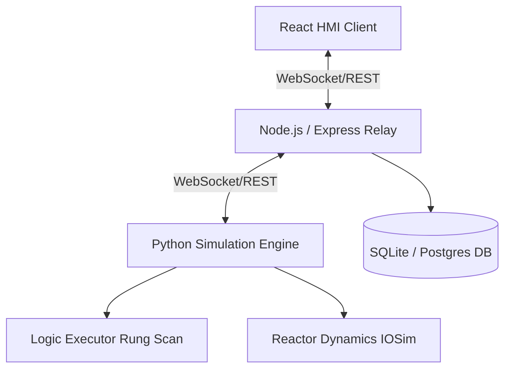

# FloorSense — Virtual Commissioning HMI Simulator

FloorSense is an industrial-grade virtual commissioning platform. Controls and automation engineers use it to validate PLC logic, alarm sequencing, and HMI mimics in simulation before deploying programs to physical machinery.

## System Architecture



- **Simulation Engine (Python)**: Owns the core 100ms scan-cycle loop. Integrates 1st-order physical dynamics (mass/heat balance) and executes PLC structured-text-like logic expressions in a sandboxed execution scope. Streams tag updates via raw WebSockets.
- **Backend Express Server (Node.js)**: Central system of record. Stores configuration, logs force records, evaluates alarm limits on WebSocket scan ticks, handles alarm acknowledgements, and orchestrates test-plan validation runs.
- **Frontend HMI Client (React / TypeScript)**: A high-density HMI styled in compliance with **ISA-101 (High-Performance HMI)** guidelines. It features a solid gray canvasing base, with colors reserved strictly for live equipment or abnormal alarms.

---

## Technical Specifications

### 1. High-Performance HMI Colors (ISA-101)
- **Background**: Canvas uses `--panel-700` (`#2B2E31`), providing a neutral dark backdrop that reduces eye strain.
- **Piping / Valves / Tanks**: Grayscale lines (`#E8E9EA` / `#4A4E52`) that highlight structural elements without being visually loud.
- **Normal Operations**: `--running-teal` (`#4FA69C`) highlights energized elements (valves open, pump running, active step) only when active.
- **Alarms**: Strict color assignments: Red (`#E13B3B`) for high alarms, Yellow (`#E1A73B`) for warnings, and Blue (`#3B8FE1`) for low/info events.

### 2. Monospace Typing
All tags, values, registers, and timestamps use monospaced fonts (e.g. `LT_101.PV`, `2026-07-16T14:23:33Z`), preserving column alignment and matching terminal register views on real SCADA systems.

### 3. Commissioning Workflow & Test Plans
Test plans are structured lists of actions (write/force tags) and assertions (validating tag values match expected bounds). The backend test runner evaluates transitions against a timeout, outputting step-by-step PASS/FAIL diagnostics.

---

## Getting Started

### Method A: Docker Compose (Recommended)

To spin up all services (PostgreSQL, Python Engine, Express Backend, React HMI client) automatically:

1. Make sure you have Docker and Docker Compose installed.
2. In the project root, run:
   ```bash
   docker-compose up --build
   ```
3. Open [http://localhost:3000](http://localhost:3000) in your web browser.

---

## Directory Layout

```
/floorsense
  ├── docker-compose.yml     # Multi-service configuration
  │
  ├── /simulation-engine     # Python 3.11 simulation daemon
  │     ├── main.py          # FastAPI application server entrypoint
  │     ├── /engine          # Scan cycle, registers table, physics and ST logic
  │     └── /api             # WS broadcasts and HTTP force APIs
  │
  ├── /server                # Node.js TypeScript REST backend
  │     ├── src/server.ts    # Database schema check and app startup listener
  │     ├── src/ws/relay.ts  # Web client WS stream relay and alarm compiler
  │     └── src/modules/     # Project, machine, and test runner controllers
  │
  └── /client                # React 19 + Vite + Tailwind HMI dashboard
        ├── src/App.tsx      # WebSocket event listener and page grids
        ├── src/components/  # Mimic schematic, alarm grid, tag table, test panel
        └── src/index.css    # Google Fonts import and animated piping styles
```
